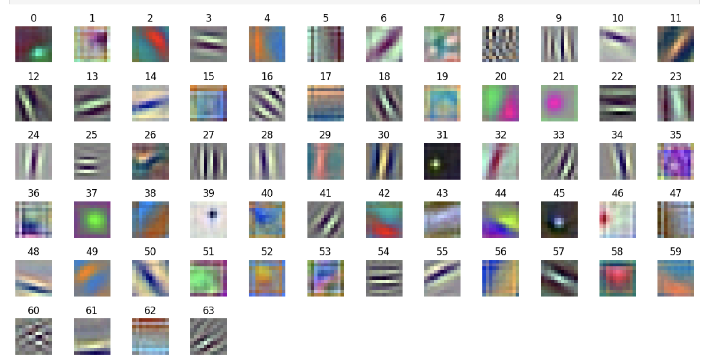
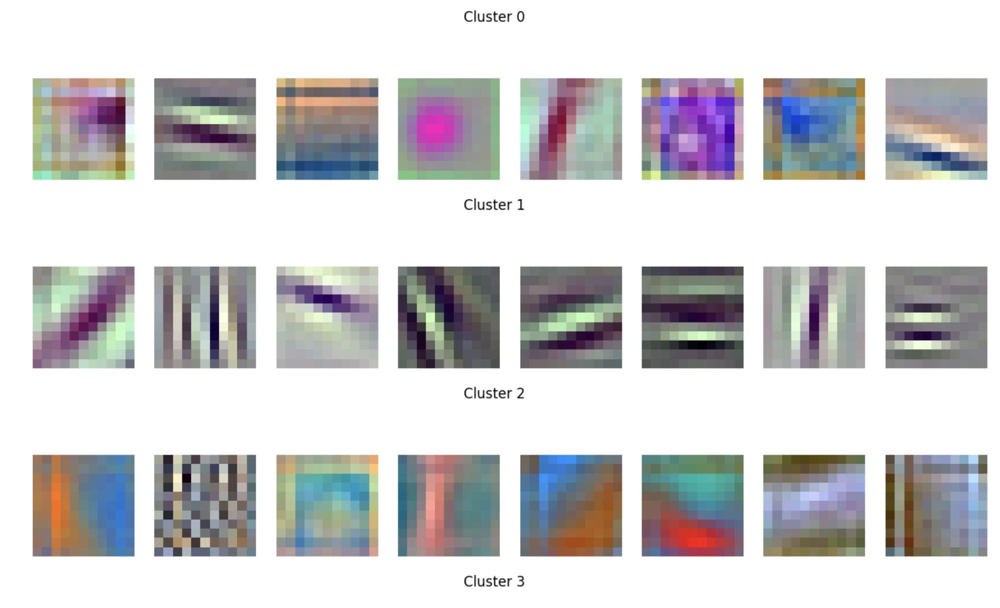
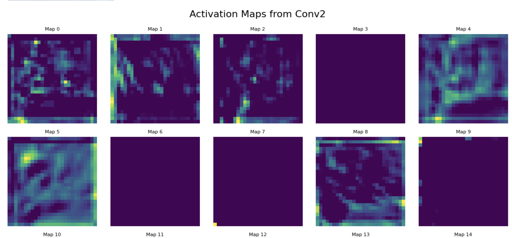

# Exploring Alexnet 

[Original paper](https://proceedings.neurips.cc/paper_files/paper/2012/file/c399862d3b9d6b76c8436e924a68c45b-Paper.pdf) 

There are some differences I noticed in the original paper and the pytorch implementation

- The architecture doesn't exactly match. The first layer in the paper had 96 kernels, while in the pytorch implementation, it has 64 kernels. It must be due to efficiency of using 64.
- The paper mentions normalization named "LRN" (Local Response Normalisation), but this is not used in the pytorch implementation.
- The architecture mentioned in the paper uses parallel processing in GPU's, but I think it's not relvenet now, and hence not used in the current implementation.

# What you will find in the notebook
I created this notebook while exploring the Alexnet architecture. I tried plotting the 64 kernels in the first layer. 

I then tried to cluster the 64 clusters. Initially, I clusted using the kernels, but it didn't gave good results, and I have mentioned the possible reason in the notebook.
Later, I used clustering using activation maps, and this was giving better results. 

I have also created activation maps of the next layer, but I am not sure how can I infer them. 

Also, do check [this](https://adamharley.com/nn_vis/cnn/3d.html) and [this](https://poloclub.github.io/cnn-explainer/) for some cool visualizations of CNN, I was thinking about creating something similar, but it's seems to be way out of my league as of now, lol, but will surely do it in future. 
